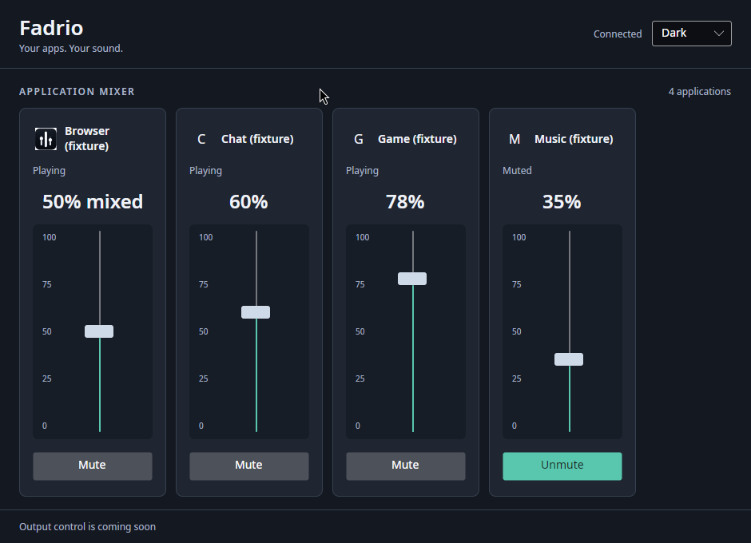

<p align="center">
  <picture>
    <source media="(prefers-color-scheme: dark)" srcset="assets/branding/raster/fadrio-banner-dark.png">
    <source media="(prefers-color-scheme: light)" srcset="assets/branding/raster/fadrio-banner-light.png">
    
  </picture>
</p>

<p align="center">
  A Linux volume mixer that controls applications—not raw audio streams.
</p>

<p align="center">
  <a href="LICENSE"></a>
  <a href="https://github.com/ATAC-Helicopter/Fadrio/releases"></a>
  
  
  
</p>

Fadrio resolves PipeWire playback nodes into stable logical applications and groups every session owned by an application behind one mixer target. Three browser streams should look like one **Brave** or **Firefox** control—not three nodes, renderer processes, or PIDs.

> [!IMPORTANT]
> Fadrio is a source-only public alpha, not an end-user release. No supported binary package is published yet. Basic identity persistence and live application controls exist, but durable mixer policies, MIDI control, output control, and the finished interface are not implemented. Initial Steam/Proton identification requires corroborating local process, compatibility-directory, and installed-manifest evidence.

## What works today

- Native PipeWire registry connection and playback-node events.
- Versioned C ABI with copied, serialized managed events.
- Linux `/proc` and automatically refreshed XDG desktop-entry identity resolution.
- Deterministic multi-evidence scoring with safe conflict fallback.
- Flatpak-first canonical identity from bounded sandbox metadata and exported desktop entries.
- Optional Snap identity from corroborated wrapper metadata, without a Snap runtime dependency.
- Secure local PNG icon resolution with trusted-root checks and a bounded XDG cache.
- Stable fallback identities that never use PID.
- Multi-session application grouping and application-wide volume/mute commands.
- Managed reconnect supervision with generation isolation.
- Diagnostic CLI, SQLite-backed identity overrides, and a live Avalonia application console with vertical volume faders, mute controls, and session-scoped themes.

## Architecture

```text
PipeWire sessions
    ↓
Application identity resolver
    ↓
Logical applications
    ↓
Mixer state
    ↓
UI / MIDI / CLI / D-Bus
```

The complete product contract is in [TECH_SPEC.md](TECH_SPEC.md). Start with the shorter [architecture overview](docs/architecture/overview.md) when contributing.

Planning is tracked in the canonical [ROADMAP.md](ROADMAP.md) and mirrored to the [Fadrio Roadmap GitHub Project](https://github.com/users/ATAC-Helicopter/projects/9). Alpha source snapshots and their checksums are published on [GitHub Releases](https://github.com/ATAC-Helicopter/Fadrio/releases).

## Build

Install the dependencies in [the Linux setup guide](docs/development/setup-linux.md), then run:

```bash
./scripts/build.sh
./scripts/test.sh
```

Inspect current logical applications:

```bash
dotnet run --project src/Fadrio.Cli -- apps --watch
```

Inspect one application's resolver evidence and raw audio sessions explicitly:

```bash
dotnet run --project src/Fadrio.Cli -- inspect xdg:org.mozilla.firefox
dotnet run --project src/Fadrio.Cli -- inspect xdg:org.mozilla.firefox --redacted
```

Use `--redacted` before sharing output. The ordinary application list intentionally omits process IDs and raw node details.

Application names and icons can be overridden persistently from the CLI:

```bash
dotnet run --project src/Fadrio.Cli -- profile name xdg:firefox "My browser"
dotnet run --project src/Fadrio.Cli -- profile icon xdg:firefox firefox
dotnet run --project src/Fadrio.Cli -- profile clear xdg:firefox
```

The override appears in subsequent `apps` output while the canonical ID remains unchanged.

Launch the in-development mixer with `dotnet run --project src/Fadrio.UI`. Its application rows reflect the live PipeWire snapshot and use the same application-wide volume/mute command path as the CLI. Application rows load validated local PNG icons asynchronously, fall back to an initial when artwork is missing or invalid, and show playback/mute state. Mixed-volume controls explain that an adjustment sets every owned stream to the same level. Output-device controls, tray behavior, and UI polish remain on the roadmap.

The current console uses vertical percentage faders and a horizontally scrollable bank of logical applications. Choose System, Light or Dark for the current session.



This actual 940 × 680 capture uses four controlled silent applications and five streams on a private PipeWire daemon, with normal host fonts. [Light theme](docs/screenshots/fad-0502-console-light.png), [narrow layout](docs/screenshots/fad-0502-console-narrow.png), and [qualification evidence](docs/development/qualifying-console-ui.md) are available. Reproduce with `./scripts/capture-console.sh` after building.

[See the first live-row screenshot](docs/screenshots/fad-0501-live-fixture.png), captured with a controlled, silent PipeWire fixture rather than a user's applications.

Exercise the shared M0 command path:

```bash
dotnet run --project src/Fadrio.Cli -- set <canonical-id> 35
dotnet run --project src/Fadrio.Cli -- mute <canonical-id>
dotnet run --project src/Fadrio.Cli -- unmute <canonical-id>
```

These commands currently open a short-lived PipeWire client. A later milestone will route them through the single running instance over D-Bus.

## Scope

Fadrio is not a PipeWire graph editor, DAW, DSP host, recorder, virtual-device manager, or network audio server. See [product scope](docs/product/scope.md).

## Contributing and security

Contributions are welcome. Read [CONTRIBUTING.md](CONTRIBUTING.md), the repository-specific [agent rules](AGENTS.md), and the [Code of Conduct](CODE_OF_CONDUCT.md). Report vulnerabilities using [SECURITY.md](SECURITY.md), not a public issue.

## License

Copyright © 2026 Fadrio contributors. Fadrio is free software licensed under [GPL-3.0-or-later](LICENSE). Third-party components retain their respective licenses; see [THIRD_PARTY_NOTICES.md](THIRD_PARTY_NOTICES.md).
