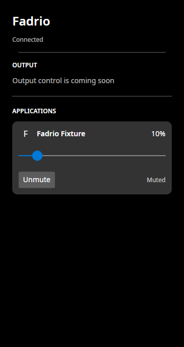

# FAD-0502 application-row slice

Recorded on 2026-10-06 on the local GNOME Wayland desktop through XWayland. This is application-row progress; output-device controls and the REL-00006 desktop matrix remain open.

## Behavior

Rows display the resolved identity's local PNG icon, or the first Unicode text element of the application name when artwork is missing, rejected, or undecodable. The existing local resolver enforces trusted XDG roots, source/dimension limits, and bounded disk caching. No network access or SVG decoder is added. Two concurrent background loads are allowed; decoded thumbnails fit within 64 x 64 pixels. Reference changes and row detachment cancel obsolete loads, clear the old image, and dispose replaced or stale bitmaps. Backend snapshots do not wait for artwork.

The fallback adds no tab stop; application name, slider and mute remain the usable controls. Long names have a tooltip. Mixed-volume help is available both as a tooltip and automation help text: a slider adjustment sets every owned stream to the same level. Playing/Idle reflects the existing backend stream state, not measured signal amplitude; Muted is explicit text. Screen-reader conformance remains unqualified.

A header-only PNG passed the resolver's header check but caused Avalonia.Skia 12.1.2 to dereference a null codec in `ImmutableBitmap`. The UI contains that specific exception at the decode boundary, uses the text fallback, and keeps the row usable. The desktop harness retains this real malformed-input regression; it is not a synthetic claim that all image decoders are safe.

## Local validation

- `FADRIO_RUN_PIPEWIRE_INTEGRATION=1 ./scripts/test.sh`: 109 managed tests, two native tests, and isolated PipeWire integration passed.
- Seven additional UI cases cover icon/reference refresh on a reused row, Unicode fallback, activity/mute state, and mixed-volume explanation after adjustment. The UI suite has 23 cases.
- Six Python roadmap/synchronization tests, roadmap audit, formatting verification, and whitespace check passed.
- `./scripts/test-ui-interactions.sh` with default `FADRIO_UI_FONT_MODE=host`: rendered icon, 37% drag, Home + ten Right keys to 10%, mute, usable controls after a header-only icon, disconnect during drag, and controls after isolated daemon restart.
- The native bridge and Core dependencies are unchanged. No ordinary host audio is modified by the harness.

The screenshots show the actual 360 x 680 Avalonia window with a silent, controlled `Fadrio Fixture` stream and the project's own licensed icon, not third-party application artwork or a design mockup.

## Startup observation and limits

The normal host-font configuration reached the mixer in the bounded local checks; the retained harness records whole-second window readiness in `startup.txt`. There are 2,773 entries in this host's current `fc-list` output. No fonts or host caches were removed or restricted. The old BUG-00004 stall did not reproduce, so its original root cause remains unknown and the ticket stays open. Rider could list configurations but reported that its debug launch did not start; the direct window/trace and harness are the runtime evidence here.

The harness locates the slider from its actual rendered track with Python Pillow, rather than assuming fixed font metrics. It asks GNOME to activate the owned window through `_NET_ACTIVE_WINDOW`, verifies X keyboard focus, explicitly focuses the recreated slider, and polls observed backend state with a bounded timeout after asynchronous commands. Direct X input-focus assignment alone produced intermittent keyboard-probe failures. The harness defaults to inherited host fonts. `FADRIO_UI_FONT_MODE=fixture` is an explicit process-local alternative for fixture diagnosis. A screenshot/control result is not KDE, native Wayland, fractional scaling, packaged installation, or long-running qualification. PNG-only loading means some installed SVG-only icons use the fallback. Unchanged references are loaded on attach/reference change; file watching for already displayed artwork is not implemented in this slice.
